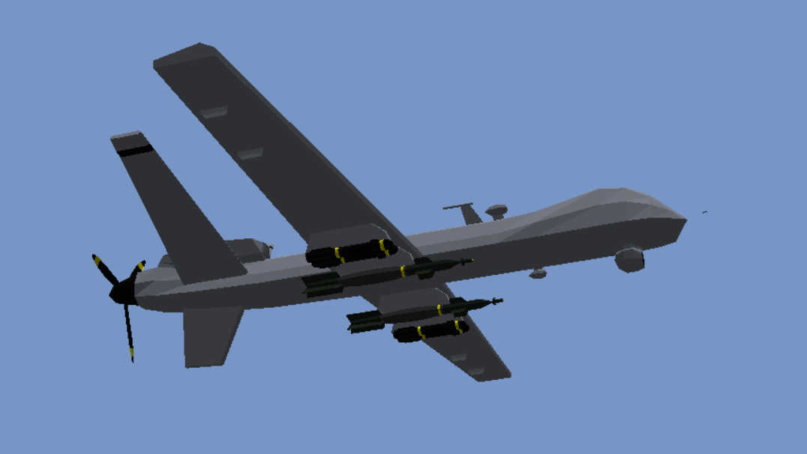

 
    

# REAPER 1.0

A retro combat flight simulator for the MQ-9 Reaper military drone playable in the browser. The art style is inspired by classic 90s games like A-10 Attack! (1995) and SU-27 Flanker (1995).

### Links

https://answers.unity.com/questions/696271/how-create-modern-aircrafts-hud.html
https://developer.mozilla.org/en-US/docs/Web/JavaScript/A_re-introduction_to_JavaScript
